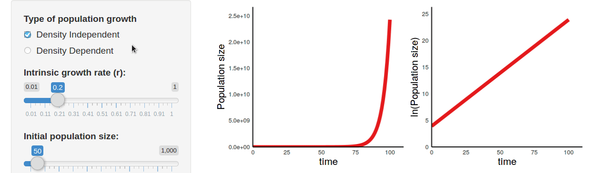

## Welcome to EcoEvoApps

This is a community resource for interactive ([shiny](https://shiny.rstudio.com/)) apps of mathematical models from ecology and evolution. Thanks for visiting the site, and feel free to [get in touch](mailto:ecoevoapps@gmail.com) with any questions or suggestions!

### How it works

EcoEvoApps allow users to explore the dynamics of apps through simple simulations. For example, when exploring [population growth in continuous time](https://ecoevoapps.gitlab.io/apps/singlepop-continuous/), users can switch between density-independent or dependent growth, and can easily change parameter values: 




### What models are available? 

The complete list of apps is available on the [EcoEvoApps website](https://ecoevoapps.gitlab.io/app-collection/). 

The current focus of EcoEvoApps has been on models from population and community ecology, but we are looking to expand to other areas of EEB - please get in touch if you'd like to contrbiute new apps!


#### Installation

`ecoevoapps` can be installed directly from Gitlab (or its mirror on Github), as follows:

```
if (!requireNamespace("remotes", quietly = TRUE))
      install.packages('remotes')
remotes::install_gitlab("ecoevoapps/ecoevoapps")

# Or, install from github
# (This can be helpful if you plan on deploying the shiny apps to your own
# shinyapps.io account, as packages installed from gitlab don't automatically
# get installed during the shinyapps.io deployment.)
# remotes::install_github("gauravsk/ecoevoapps")
```


#### Running models from the R command line

While the primary motivation of this package is to provide interactive apps for simulating model dynamics, the package also includes a variety of functions with which users can directly simulate model dynamics through `R`. For example, the Lotka-Volterra competition model can be run using `run_lvcomp_model()`:

```
ecoevoapps::run_lvcomp_model(time = 100, params = c(K1 = 500, K2 = 500, a = .07, 
                                                      b = .07, r1 = .6, r2 = .8), 
                               init = c(N1 = 100, N2 = 50))
```

The complete list of functions for running and plotting model outputs is available the [reference index](reference/index.html). For more details on how to implement particular models through the R command line, check out the package [vignettes](articles/index.html).

## Contributing

We'd love for you to join us in making mathematical models more easily accessible for people of all backgrounds! If you'd like to contribute to this project by contributing new apps or translations, or in any other way, please check out our contribution guidelines: `vignette("contributing")`


